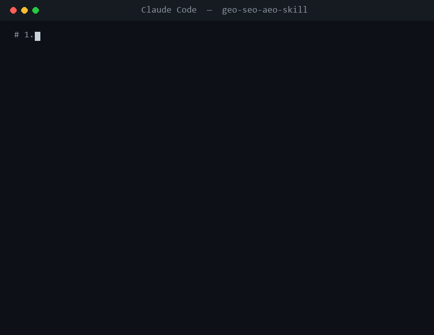

# Web Optimization Skill — SEO · GEO · AEO

An open-source [Agent Skill](https://docs.claude.com/en/docs/claude-code/skills)
that helps an AI agent **audit and generate web content** optimized for three
audiences at once:

- **SEO** — traditional search ranking (Google/Bing)
- **GEO** — Generative Engine Optimization (ChatGPT, Perplexity, Google AI Overviews, Claude)
- **AEO** — Answer Engine Optimization (featured snippets, voice, "People Also Ask")

Built and maintained by **[Staksoft](https://www.staksoft.com)**. It operationalizes
the frameworks from our guide
[*Beyond Keywords: The Definitive Guide to GEO in 2026*](https://www.staksoft.com/insights/seo/beyond-keywords-the-definitive-guide-to-generative-engine-optimization-geo-in-2026).

Free to use, modify, and share under the [MIT License](LICENSE).

<p align="center">
  
</p>

> The demo above is regenerated with `python scripts/generate_demo.py`.

---

## What it does

| Workflow | Input | Output |
|----------|-------|--------|
| **Audit** | A URL or local HTML/Markdown file | Prioritized, concrete fix list scored across SEO/GEO/AEO |
| **Generate** | A topic/brief + target query | Optimized content + JSON-LD schema + an `llms.txt` entry |

Highlights:
- Flags weak, hedge-heavy copy ("very fast", "scalable") and pushes for
  **quantified, citable claims** ("sub-50ms p95 latency") — what LLMs actually cite.
- Checks for the **`llms.txt`** standard, structured data, answer-first formatting, and snippet eligibility.
- Ships a **dependency-free Python audit script** (`scripts/audit.py`) for objective, repeatable checks.

## Install

### As a Claude Code skill
Copy the skill into your skills directory:

```bash
# personal (all your projects)
git clone https://github.com/<your-org>/geo-seo-aeo-skill.git \
  ~/.claude/skills/web-optimization

# or project-scoped (shared with your team via the repo)
git clone https://github.com/<your-org>/geo-seo-aeo-skill.git \
  .claude/skills/web-optimization
```

It auto-activates when you ask things like *"audit example.com for GEO"* or
*"write an SEO/GEO/AEO-optimized article about X"*.

### Standalone audit script (no agent needed)
```bash
python scripts/audit.py https://example.com/page
python scripts/audit.py --file page.html
```
Requires only Python 3.8+ (standard library — no `pip install`).

## Repository layout

```
SKILL.md                      Entry point: when-to-use, the two workflows, routing
references/
  seo.md  geo.md  aeo.md       The three optimization lenses
  schema.md  scoring.md        JSON-LD patterns + the audit rubric
assets/
  llms-txt-template.md         Fill-in /llms.txt template
  audit-report-template.md     Report output format
  schema-templates/            Article, FAQPage, HowTo, Product JSON-LD
scripts/audit.py               Deterministic HTML checks -> JSON
tests/                         Golden weak/strong fixtures + expectations
```

## Example: audit output (excerpt)
```json
{
  "seo":  { "title_ok": false, "meta_description_ok": true, "images_missing_alt": 1 },
  "geo":  { "hedge_total": 11, "quantified_signal_count": 0, "llms_txt": { "exists": false } },
  "aeo":  { "has_faq_schema": false, "question_headings": ["How do I get started?"] }
}
```
The agent turns these signals into a prioritized, plain-English action list.

## Contributing

Issues and PRs welcome — improvements to the lenses, schema templates, or checks
help everyone. By contributing you agree your work is released under the MIT License.

## About Staksoft

[Staksoft](https://www.staksoft.com) builds custom software and helps teams get
discovered in the age of AI search. If this skill is useful, a ⭐ on the repo —
and a read of our [Insights blog](https://www.staksoft.com/insights) — is appreciated.
